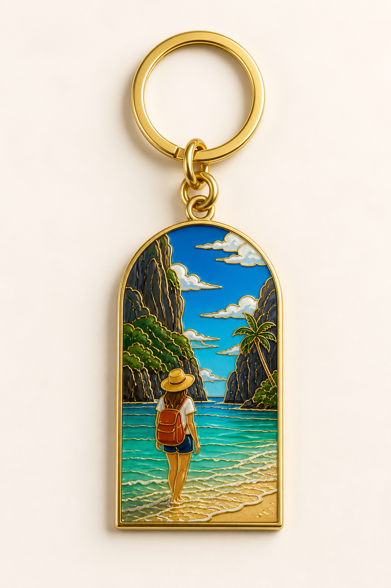
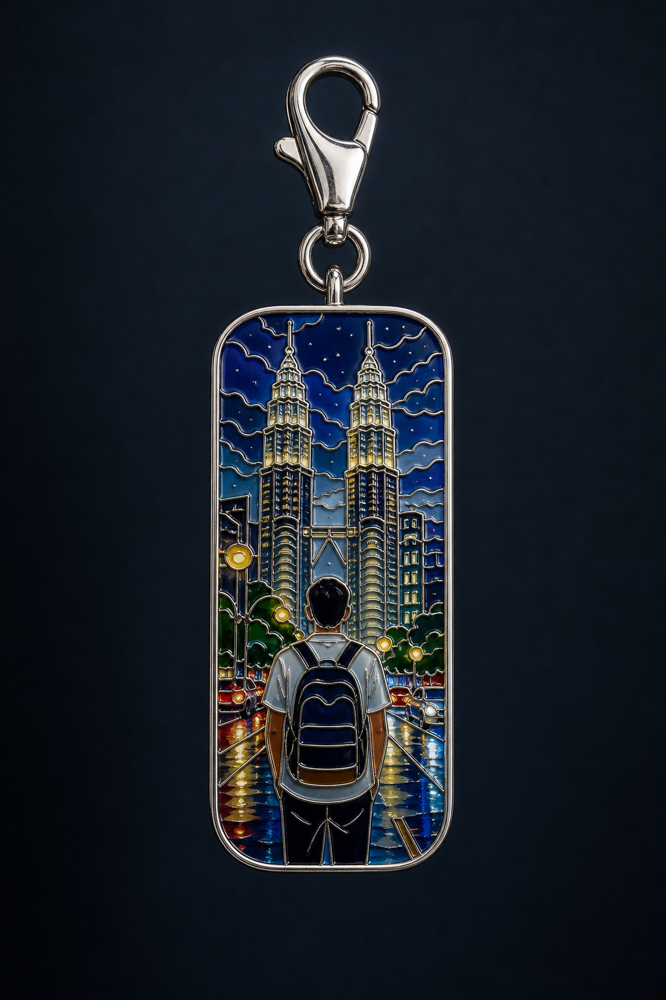
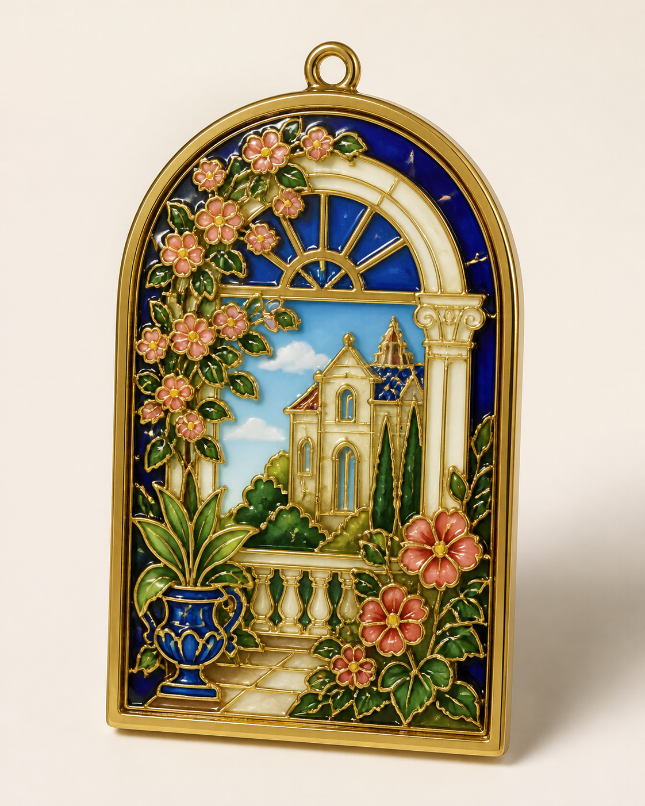
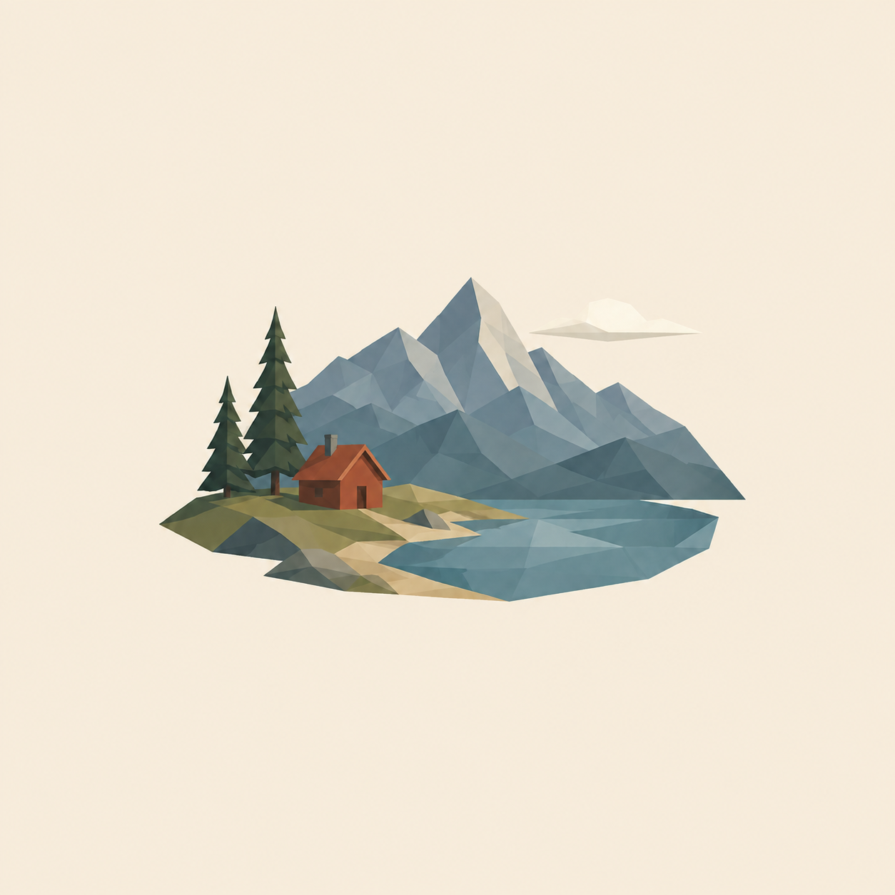

# Junda Visual Craft

> 把照片与想象，转译成有工艺感的视觉作品。

`junda-visual-craft` 是 Junda 品牌下的风格化视觉设计 Skill。它接受**参考图、纯文字、参考图加文字**三种输入，先建立内容规格，再分别选择视觉风格与展示形式，生成并验收最终图片。

这里的钥匙扣、冰箱贴、手机壳、封面或包装只是设计的展示载体，不是 Skill 的能力边界。品牌能力由两个可以独立扩展的维度组成：

- **视觉风格**：决定线条、材质、色彩与整体气质；
- **展示形式**：决定画面独立存在，还是应用于某种真实载体的概念效果图。

当前风格库包括：

- **掐丝珐琅 / 景泰蓝**：金属掐丝、烧制釉面、珠宝质感；
- **极简纸感丙烯**：粗糙白纸、小主体、大留白、少量手绘线与 2–4 种明确色块；
- **极简低多边形编辑插画**：二维几何光影切面、居中场景标本、纯色大留白与自然收边。

当前展示形式包括：

- **独立视觉图**：艺术图、封面、海报、壁纸等，不强加商品外壳或五金；
- **载体应用效果图**：手机壳、钥匙扣、冰箱贴、包挂、吊坠、徽章、纪念牌、包装、卡片，以及用户指定的其他载体。

本 Skill 交付视觉概念，不提供可直接投产的 CAD、开模图、工程尺寸、报价或生产证明；数字艺术图也不代表真实手绘原作已经制作。

## 使用流程

1. **提供内容**：上传参考图、写明文字主题，或同时提供图片与修改要求；只有图片和可执行文字主题都缺失时才会追问。
2. **建立内容规格**：图片路线锁定主体与构图不变量；纯文字路线锁定明确写出的主体、数量、动作、场景、颜色和氛围；混合路线以图片为事实锚点、文字为修改要求。
3. **选择视觉风格**：用户已指定时直接沿用；否则提供适合当前内容的简短选项。
4. **选择展示形式**：独立视觉图，或载体应用效果图；未列出的载体也可按真实结构建立规格。
5. **生成与验收**：按所选分支生成，并检查输入一致性、风格辨识、展示形式和整体完成度。

两个维度可以自由组合：

| 视觉风格 | 独立视觉图 | 载体应用效果图 |
| --- | --- | --- |
| 掐丝珐琅 | 满画幅珐琅艺术面、封面或海报 | 金属纪念品，或适配手机壳等载体的珐琅纹样、装饰面与嵌片概念 |
| 极简纸感丙烯 | 纸面艺术图、封面或壁纸 | 将纸感丙烯视觉应用到冰箱贴、手机壳、包装或卡片 |
| 极简低多边形编辑插画 | 风景标本、人物场景切片、肖像、运动瞬间或编辑海报 | 将二维几何色面应用到手机壳、冰箱贴、包装等载体，不改变载体真实结构 |

除非用户明确要求混合，不会把金属掐丝、玻璃釉面、纸张纹理和丙烯平涂混成一种含混材质。

## 安装

默认使用交互式安装：

```bash
npx -y skills add jjd0324/junda-visual-craft
```

如果已经了解自己的 Agent 环境，并希望全局安装到所有支持的客户端：

```bash
npx -y skills add jjd0324/junda-visual-craft -g --all
```

### 从旧名称迁移

`v0.5.0` 将技术标识从 `cloisonne-keepsake-design` 改为 `junda-visual-craft`。已有旧版安装不会自动改名；安装新版后，请改用 `$junda-visual-craft`。如宿主同时发现两个版本，建议停用旧版，避免相似描述造成重复触发。

旧仓库链接会由 GitHub 自动重定向到新仓库，但新文档、安装命令和后续 Release 统一使用 `jjd0324/junda-visual-craft`。

## 使用与宿主差异

在支持 Skills 选择界面的客户端中，可用 `@` 选择本 Skill；在 Codex CLI / IDE 中可用 `$junda-visual-craft` 或 `/skills` 显式调用。自动调用由各宿主根据描述匹配，不能保证每个客户端行为一致。

示例：

> 使用 $junda-visual-craft 分析我上传的参考图，先让我选择视觉风格和展示形式，再生成图片。

> 使用 $junda-visual-craft 把这张旅行照做成极简纸感丙烯封面，保留山峰轮廓并预留标题区。

> 使用 $junda-visual-craft 把这张合影设计成掐丝珐琅冰箱贴，保留人物顺序。

> 使用 $junda-visual-craft 把宠物照片转成适合深色手机壳的掐丝珐琅装饰面概念，不要钥匙扣五金。

> 使用 $junda-visual-craft，不上传图片：生成一张极简纸感丙烯风景图，主题是雪夜窗边戴红围巾的黑猫。

> 使用 $junda-visual-craft 把这张人物旅行照转成极简低多边形编辑插画，保留姿态、服饰和吊桥环境，做成带大面积暖象牙留白的独立视觉图。

> 使用 $junda-visual-craft 只根据文字生成极简低多边形肖像海报：戴圆框眼镜、深绿外套、侧身回望，不要 3D，不要文字。

> 使用 $junda-visual-craft 把这张跑步照片转成极简低多边形人物运动瞬间，保留腾空步态、摆臂方向和服饰，前进方向多留白。

如果当前环境不能读取图片或没有图片生成工具，Skill 只交付已标注状态的提示词、设计规格与验收规则，不假装已经生成图片。

## 模板画廊

以下是可公开复用的通用 AI 概念预览。它们不包含、也不复刻任何用户原始照片；每个模板均可由参考图、文字描述或两者组合驱动，并包含风格、展示结构、可复制提示词和验收点。

### 掐丝珐琅 · 载体应用

| 海岛旅行钥匙扣 | 瀑布建筑冰箱贴 | 城市夜景包挂 | 人与宠物吊坠 |
| --- | --- | --- | --- |
| [](skills/junda-visual-craft/references/templates/01-tropical-beach-keychain.md) | [](skills/junda-visual-craft/references/templates/02-rain-vortex-magnet.md) | [](skills/junda-visual-craft/references/templates/03-city-night-bag-charm.md) | [](skills/junda-visual-craft/references/templates/04-cat-companion-pendant.md) |

| 山野徒步徽章 | 宠物肖像手机挂件 | 合影里程碑纪念牌 | 花园窗景装饰挂件 |
| --- | --- | --- | --- |
| [](skills/junda-visual-craft/references/templates/05-mountain-hike-badge.md) | [](skills/junda-visual-craft/references/templates/06-pet-portrait-phone-charm.md) | [](skills/junda-visual-craft/references/templates/07-group-milestone-plaque.md) | [](skills/junda-visual-craft/references/templates/08-garden-window-ornament.md) |

### 独立视觉图与跨风格应用

| 极简风景艺术图 | 极简建筑封面 | 极简风景冰箱贴 | 珐琅风景艺术图 |
| --- | --- | --- | --- |
| [](skills/junda-visual-craft/references/templates/09-minimal-paper-acrylic-landscape.md) | [](skills/junda-visual-craft/references/templates/10-minimal-paper-acrylic-architecture.md) | [](skills/junda-visual-craft/references/templates/11-minimal-paper-acrylic-magnet.md) | [](skills/junda-visual-craft/references/templates/12-cloisonne-landscape-artwork.md) |

### 极简低多边形编辑插画

| 风景标本 | 人物场景切片 | 肖像几何海报 | 人物运动瞬间 |
| --- | --- | --- | --- |
| [](skills/junda-visual-craft/references/templates/13-low-poly-landscape-vignette.md) | [](skills/junda-visual-craft/references/templates/14-low-poly-environmental-portrait.md) | [](skills/junda-visual-craft/references/templates/15-low-poly-portrait-poster.md) | [](skills/junda-visual-craft/references/templates/16-low-poly-athletic-motion.md) |

查看完整的 [模板索引](skills/junda-visual-craft/references/templates/README.md)。

## 风格研究说明

“极简纸感丙烯”分支参考了 [Adrian Punk 的公开 X Article](https://x.com/AdrianPunk115/status/2089960426624758079) 中对旅行照片视觉提炼的讨论；“极简低多边形编辑插画”分支参考了其另一则 [公开 X 帖子](https://x.com/AdrianPunk115/status/2095418987853307959) 对照片几何化与留白版式的展示。本仓库只重新提炼可复用的设计原则，没有复制原帖图片、具体人物与场景组合、作者签名、水印、默认配色或完整提示词；新增预览均为重新生成的通用视觉原型。

## 公开评测基线

[`evals/public/`](evals/public/README.md) 提供可公开复核的合成契约：触发边界、行为约束与人工视觉抽检量表。它用于防止规则和文件结构回退，不是对任意宿主自动路由、人物一致性或模型视觉稳定性的自动证明。

不提交用户原图、私人评测、真实运行记录、预期生成图或任何可识别个人信息。

## 仓库结构

```text
skills/junda-visual-craft/
├── SKILL.md                         # 可安装的主 Skill 与流程路由
├── agents/openai.yaml               # 品牌展示与调用信息
├── assets/template-previews/        # 通用 AI 概念预览图
└── references/
    ├── style-presets.md             # 顶层风格路由
    ├── styles/                      # 各风格的详细规则
    ├── output-formats.md            # 独立视觉图与载体应用规则
    ├── product-presets.md           # 各类载体的可见结构规则
    ├── composition-complexity.md    # 复杂构图简化策略
    ├── delivery-format.md           # 结构化交付与打样沟通 Brief
    ├── quality-checklist.md         # 分支化视觉验收规则
    └── templates/                   # 16 套可复制场景模板
evals/public/                        # 公开、合成的评测契约
scripts/validate_skill.py            # 结构、隐私、链接与 PNG 校验
tests/                               # 校验器回归测试
```

## 持续维护

- 新增风格、展示形式或模板前，请先参照 [贡献规则](CONTRIBUTING.md)；
- 维护节奏与质量门槛见 [维护说明](skills/junda-visual-craft/references/maintenance.md)；
- 每次提交都会校验 YAML、模板清单、本地链接、路径越界、PNG 完整性和公开隐私标记；
- 完整更新记录见 [CHANGELOG.md](CHANGELOG.md)。

## 授权

- 代码、文档与模板按 [MIT License](LICENSE) 发布；
- `assets/template-previews/` 下的 16 张通用 AI 概念预览图按 [CC BY 4.0](ASSETS-LICENSE.md) 发布：允许商用、改编与再发布，但必须署名、链接许可证并标明改动；
- 这些预览是概念效果图，不是已制造实物、真实手绘原作或量产可行性证明。用户输入照片和外部图像服务生成的输出仍受各自权利与服务条款约束。

## 边界与隐私

- 参考图是可选输入；用户原图与私人文字内容都不会被自动写入或发布到仓库；
- 不把未经授权的人像或私人照片上传、公开或写进 Skill；
- 公开仓库只包含通用规则、非可识别模板预览和合成评测契约，不包含用户生成结果、本机路径、密钥或运行记录。
