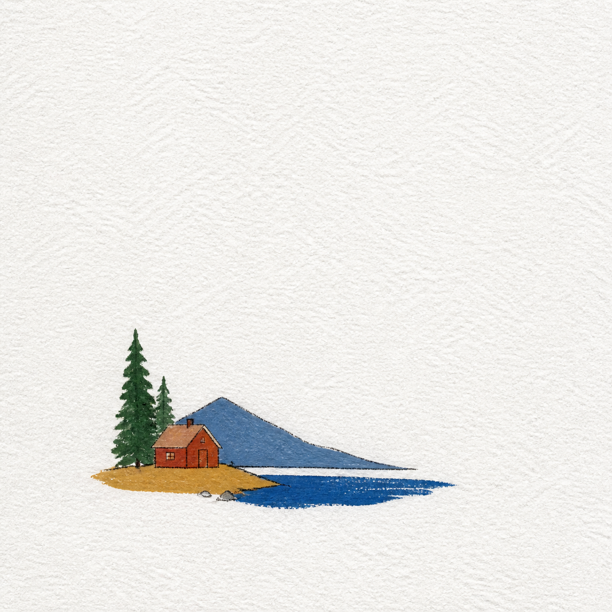

# 参考图多风格视觉设计

这是一个以**用户上传的参考图**为起点的 Agent Skill：先提取人物、宠物、风景或建筑中的视觉不变量，再独立选择风格与输出形式，最后生成并验收图片。

当前支持两大风格：

- 掐丝珐琅 / 景泰蓝：金属掐丝、烧制釉面、珠宝质感；
- 极简纸感丙烯：粗糙白纸、小主体、大留白、少量手绘线与 2–4 种明确色块。

当前支持两类输出：

- 实体纪念品：钥匙扣、冰箱贴、包挂、手机挂件、吊坠、徽章、装饰挂件、纪念牌；
- 单幅艺术图：只生成一张完整风格化图片，不包含产品边框、五金或商品棚拍结构。

对外展示名已升级为“参考图多风格视觉设计”。技术标识、仓库名和调用命令仍保留 `cloisonne-keepsake-design`，避免已有安装与链接失效。

本 Skill 只交付视觉概念：不提供可直接投产的 CAD、开模图、工程尺寸、报价或生产证明；数字艺术图也不代表真实手绘原作已经制作。

## 使用流程

1. **上传参考图**：没有参考图时，Skill 会先要求上传，不臆造内容。
2. **提取不变量**：锁定主体数量、姿态、服饰或物种特征、地点锚点、空间关系与主色。
3. **选择风格**：掐丝珐琅，或极简纸感丙烯。
4. **选择输出形式**：实体纪念品，或单幅艺术图。
5. **生成与验收**：按所选分支生成，并分别检查参考图保留、风格辨识和输出结构。

风格与输出形式是两个正交维度。例如：

| 风格 | 单幅艺术图 | 实体纪念品 |
| --- | --- | --- |
| 掐丝珐琅 | 满画幅珐琅艺术面，无五金 | 真实金属掐丝与釉面的钥匙扣、磁贴、徽章等 |
| 极简纸感丙烯 | 粗糙白纸上的极简丙烯画面 | 将纸感丙烯视觉承载到高端艺术面产品概念上 |

除非用户明确要求混合，不会把金属掐丝、玻璃釉面、纸张纹理和丙烯平涂混成一种含混材质。

## 安装

默认使用交互式安装：

```bash
npx -y skills add jjd0324/cloisonne-keepsake-design
```

如果已经了解自己的 Agent 环境，并希望全局安装到所有支持的客户端：

```bash
npx -y skills add jjd0324/cloisonne-keepsake-design -g --all
```

## 使用与宿主差异

在支持 ChatGPT Skills 选择界面的客户端中，可用 `@` 选择本 Skill；在 Codex CLI / IDE 中可用 `$cloisonne-keepsake-design` 或 `/skills` 显式调用。自动调用由各宿主根据描述匹配，不能保证每个客户端行为一致。

示例：

> 使用 $cloisonne-keepsake-design 分析我上传的参考图，先让我选择风格和输出形式，再生成图片。

> 使用 $cloisonne-keepsake-design 把这张旅行照做成极简纸感丙烯单幅艺术图，不要挂件结构。

> 使用 $cloisonne-keepsake-design 把这张合影做成掐丝珐琅冰箱贴，保留人物顺序。

如果当前环境不能读取图片或没有图片生成工具，Skill 只交付已标注状态的提示词、设计规格与验收规则，不假装已经生成图片。

## 模板画廊

以下是可公开复用的通用 AI 概念预览。它们不包含、也不复刻任何用户原始照片；每个模板均含适配参考图、风格、输出结构、可复制提示词和验收点。

### 掐丝珐琅 · 实体纪念品

| 海岛旅行钥匙扣 | 瀑布建筑冰箱贴 | 城市夜景包挂 | 人与宠物吊坠 |
| --- | --- | --- | --- |
| [](skills/cloisonne-keepsake-design/references/templates/01-tropical-beach-keychain.md) | [](skills/cloisonne-keepsake-design/references/templates/02-rain-vortex-magnet.md) | [](skills/cloisonne-keepsake-design/references/templates/03-city-night-bag-charm.md) | [](skills/cloisonne-keepsake-design/references/templates/04-cat-companion-pendant.md) |

| 山野徒步徽章 | 宠物肖像手机挂件 | 合影里程碑纪念牌 | 花园窗景装饰挂件 |
| --- | --- | --- | --- |
| [](skills/cloisonne-keepsake-design/references/templates/05-mountain-hike-badge.md) | [](skills/cloisonne-keepsake-design/references/templates/06-pet-portrait-phone-charm.md) | [](skills/cloisonne-keepsake-design/references/templates/07-group-milestone-plaque.md) | [](skills/cloisonne-keepsake-design/references/templates/08-garden-window-ornament.md) |

### 新增：多风格与单幅艺术图

| 极简风景艺术图 | 极简建筑艺术图 | 极简风景冰箱贴 | 珐琅风景艺术图 |
| --- | --- | --- | --- |
| [](skills/cloisonne-keepsake-design/references/templates/09-minimal-paper-acrylic-landscape.md) | [](skills/cloisonne-keepsake-design/references/templates/10-minimal-paper-acrylic-architecture.md) | [](skills/cloisonne-keepsake-design/references/templates/11-minimal-paper-acrylic-magnet.md) | [](skills/cloisonne-keepsake-design/references/templates/12-cloisonne-landscape-artwork.md) |

查看完整的 [模板索引](skills/cloisonne-keepsake-design/references/templates/README.md)。

## 风格研究说明

“极简纸感丙烯”分支参考了 [Adrian Punk 的公开 X Article](https://x.com/AdrianPunk115/status/2089960426624758079) 中对旅行照片视觉提炼的讨论。本仓库只重新提炼可复用的设计原则，没有复制原帖图片、作者签名、水印或完整提示词；新增预览均为重新生成的通用视觉原型。

## 公开评测基线

[`evals/public/`](evals/public/README.md) 提供可公开复核的合成契约：触发边界、行为约束与人工视觉抽检量表。它用于防止规则和文件结构回退，不是对任意宿主自动路由、人物一致性或模型视觉稳定性的自动证明。

不提交用户原图、私人评测、真实运行记录、预期生成图或任何可识别个人信息。

## 仓库结构

```text
skills/cloisonne-keepsake-design/
├── SKILL.md                         # 可安装的主 Skill 与流程路由
├── agents/openai.yaml               # UI 展示与调用信息
├── assets/template-previews/        # 通用 AI 概念预览图
└── references/
    ├── style-presets.md             # 顶层风格路由
    ├── styles/                      # 各风格的详细规则
    ├── output-formats.md            # 实体纪念品与单幅艺术图
    ├── product-presets.md           # 实体载体规则
    ├── composition-complexity.md    # 复杂构图简化策略
    ├── delivery-format.md           # 结构化交付与打样沟通 Brief
    ├── quality-checklist.md         # 分支化视觉验收规则
    └── templates/                   # 12 套可复制场景模板
evals/public/                        # 公开、合成的评测契约
scripts/validate_skill.py            # 结构、隐私、链接与 PNG 校验
tests/                               # 校验器回归测试
```

## 持续维护

- 新增风格或模板前，请先参照 [贡献规则](CONTRIBUTING.md)；
- 维护节奏与质量门槛见 [维护说明](skills/cloisonne-keepsake-design/references/maintenance.md)；
- 每次提交都会校验 YAML、模板清单、本地链接、路径越界、PNG 完整性和公开隐私标记；
- 完整更新记录见 [CHANGELOG.md](CHANGELOG.md)。

## 授权

- 代码、文档与模板按 [MIT License](LICENSE) 发布；
- `assets/template-previews/` 下的 12 张通用 AI 概念预览图按 [CC BY 4.0](ASSETS-LICENSE.md) 发布：允许商用、改编与再发布，但必须署名、链接许可证并标明改动；
- 这些预览是概念效果图，不是已制造实物、真实手绘原作或量产可行性证明。用户输入照片和外部图像服务生成的输出仍受各自权利与服务条款约束。

## 边界与隐私

- 参考图是必需输入，但用户原图不会被自动写入或发布到仓库；
- 不把未经授权的人像或私人照片上传、公开或写进 Skill；
- 公开仓库只包含通用规则、非可识别模板预览和合成评测契约，不包含用户生成结果、本机路径、密钥或运行记录。
