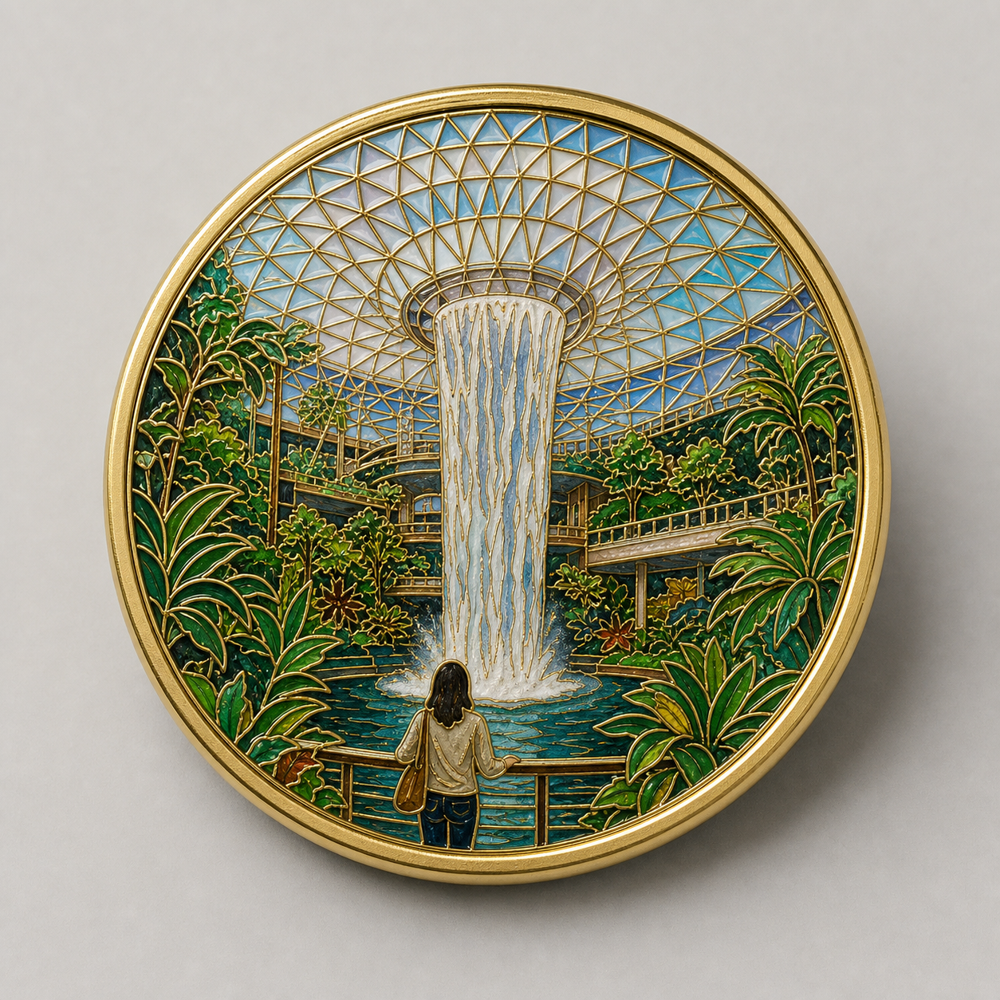

# 瀑布建筑冰箱贴



## 适用

- 巨型室内建筑、天幕、雨林、瀑布、展馆或地标照；
- 人物背影或小比例人物与建筑共同构图；
- 希望让复杂建筑线条成为纪念主体。

## 产品设定

- 载体：圆形冰箱贴；
- 结构：加宽抛光外框，正面只展示珐琅画面，不出现钥匙圈、吊链或挂孔；
- 风格：现代极简掐丝；
- 金属：暖金色；
- 背景：浅灰或暖白产品摄影背景。

## 可复制提示词

```text
将参考图中的【穹顶/网格建筑结构】、【主瀑布或中心水景】、【热带植物】和【人物背影或观看姿态】转译为一枚真实圆形掐丝珐琅冰箱贴。保留建筑的中心轴、网格透视、瀑布方向、人物位置与空间层次；把过密的建筑细节简化为均匀、可读的金属掐丝网格。

冰箱贴使用圆润抛光金属外圈，正面完整、无任何钥匙圈或吊链。所有天幕、栏杆、植被、水流和人物轮廓以细而连续的金属掐丝分区，内部为烧制玻璃质珐琅，带微凸层次、透明水感和真实反光。浅灰摄影背景，居中正面产品展示，柔和阴影，轻奢纪念品质感。

不要：钥匙扣五金、平面印刷照片、塑料、树脂滴胶、失真的建筑透视、额外人物、文字、品牌、水印。
```

## 可调变量

- 玻璃穹顶特别复杂时，用 3–5 个层级的网格密度表现远近；
- 无人物的建筑照可把人物区改成前景水池或植物；
- 用户要展示背部时，再单独生成一张带合理磁吸片的背面视图，不要画在正面。

## 验收重点

- 圆形外框完整，画面内没有钥匙圈或无关挂件；
- 穹顶网格是金属掐丝结构，不是噪点纹理；
- 瀑布、天幕和植物仍保有清晰的空间层次。
