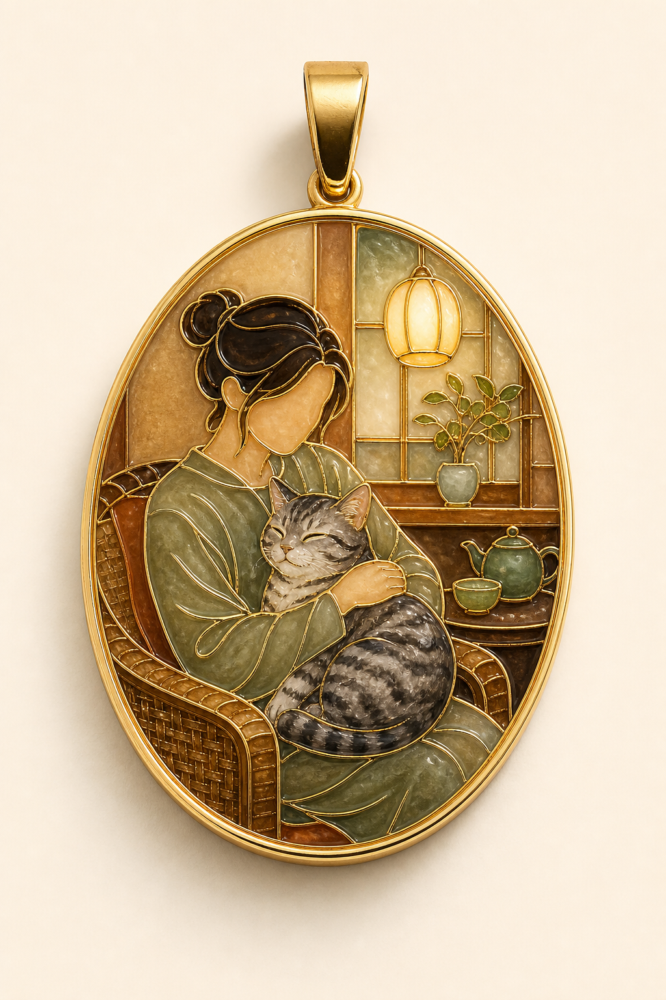

# 人与宠物吊坠



## 适用

- 人与猫、狗或其他宠物的互动照；
- 家居、咖啡馆、客厅等温暖室内纪念场景；
- 想强调陪伴感、保留人物与宠物关系的照片。

## 产品设定

- 载体：椭圆纪念吊坠；
- 五金：顶部单一闭合吊环，不默认附整条项链；
- 风格：柔和雅致珐琅；
- 金属：香槟金或浅金色；
- 背景：暖象牙白产品摄影背景。

## 可复制提示词

```text
将参考图中的【人物】与【宠物种类、毛色和姿态】、【拥抱/抱持动作】、【室内光线】和【关键家具或花植】转译为一枚真实椭圆形掐丝珐琅纪念吊坠。严格保留一人一宠的数量、彼此接触关系、宠物花纹和主体姿势；背景仅保留能说明温暖室内氛围的少量元素，避免淹没人与宠物。

使用圆润香槟金椭圆外框与顶部单一闭合吊环。人物、宠物毛发色块、衣物褶皱、椅子、灯具和植物都用细致连续的金属掐丝分区；内部填充低饱和、玻璃光泽的烧制珐琅，具有轻微起伏、真实金属反射和高端珠宝质感。暖象牙白摄影背景，吊坠完整居中展示。

不要：完整钥匙圈、塑料、亚克力、树脂滴胶、额外动物或人物、错误宠物花纹、文字、品牌、水印。
```

## 可调变量

- 宠物是深色毛发或复杂花纹时，优先区分眼睛、耳缘、鼻口和主要条纹；
- 两人或多宠物照片要先确认主体数量，再扩展椭圆牌尺寸；
- 想要冰箱贴时可保留构图，但去掉吊环并改为圆角横牌。

## 验收重点

- 人宠数量、互动关系和宠物花纹正确；
- 吊环是可靠的实体结构，未出现项链或钥匙扣五金混用；
- 室内氛围简洁，主体仍是人物与宠物。
