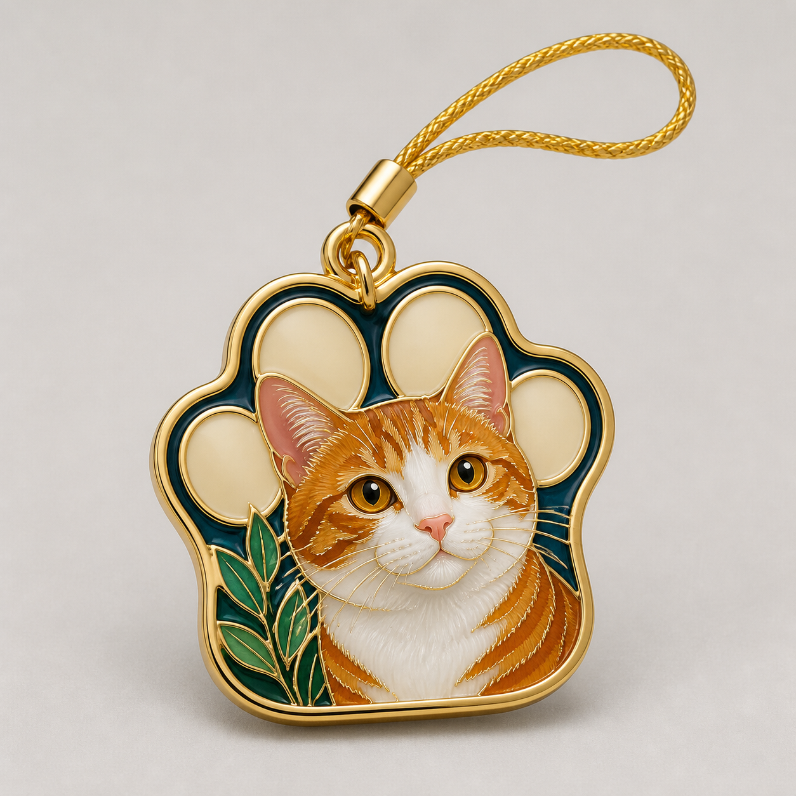

# 宠物肖像手机挂件



## 适用

- 单只猫、狗或其他宠物的近景肖像；
- 能清楚看见耳形、眼睛、毛色、花纹或项圈的照片，或写明这些特征的文字；
- 希望做成日常随身的小型纪念挂件。

## 产品设定

- 载体：圆角异形或爪印形手机挂件；
- 五金：顶部单一短挂绳环或手机挂片连接环，不附钥匙圈；
- 风格：现代极简掐丝；
- 金属：抛光浅金色或银色；
- 背景：干净暖白或浅雾灰摄影背景。

## 可复制提示词

```text
依据当前输入中的【单只宠物种类】、【耳形】、【眼睛颜色与神态】、【主要毛色和花纹】、【头部朝向】以及【项圈或一件有纪念意义的小配件】，设计一枚真实的圆角异形掐丝珐琅手机挂件。有参考图时，严格保留一只宠物的品种特征、毛色分区、耳朵姿态和目光方向；纯文字时，严格落实已描述特征。背景只留下少量色块或花植，不添加其他动物，也不凭空替换宠物特征。

挂件使用圆润抛光金属外框，顶部配一个短挂绳环或手机挂片连接环，五金完整但不出现钥匙圈、龙虾扣或项链。宠物的眼睛、耳缘、鼻口、毛发色块、条纹和小配件均用细致连续的金色金属掐丝分隔；内部填充烧制后的玻璃质珐琅，具有微微起伏、柔和通透感和精致反光。暖白摄影背景，正面居中产品展示，轻奢随身饰品质感。

不要：两只或更多宠物、额外肢体、错误毛色或花纹、钥匙圈、项链、平面照片印刷、塑料、树脂滴胶、文字、品牌、水印。
```

## 可调变量

- 宠物正脸适合爪印形或圆角异形，侧脸适合水滴形或竖向椭圆形；
- 深色毛发时优先拉开眼睛、鼻口、耳缘与主要毛色层次，避免用噪点假装毛发；
- 如果用户指定钥匙扣或吊坠，替换五金并保留单只宠物的肖像构图。

## 验收重点

- 宠物数量、品种特征、耳形、毛色与花纹没有漂移；
- 挂绳环或手机挂片连接合理，未混入钥匙圈、项链等无关五金；
- 毛发和五官被真实金属掐丝分区，仍能读出宠物的神态。
