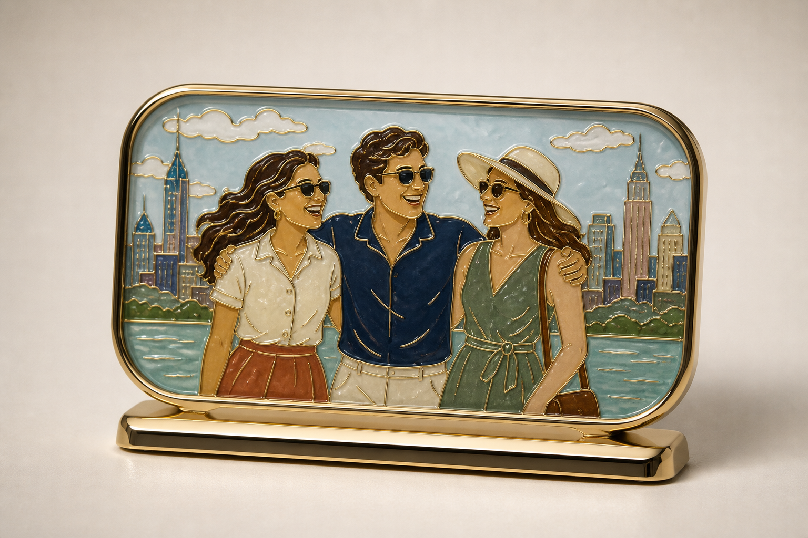

# 合影里程碑纪念牌



## 适用

- 2–4 人的家庭、毕业、周年、旅行或团队合影，或写明人物关系的文字描述；
- 人物左右顺序明确、服饰色彩有辨识度的横向构图；
- 希望做成可陈列的纪念物，而不只是随身挂件。

## 产品设定

- 载体：横向圆角掐丝珐琅桌面纪念牌；
- 结构：主牌搭配低矮、稳定的金属底座，正面不附钥匙圈或吊环；
- 风格：柔和雅致珐琅；
- 金属：香槟金或浅金色；
- 背景：暖象牙白或浅石灰棚拍背景。

## 可复制提示词

```text
依据当前输入中的【2–4 位人物】、【从左到右的顺序】、【相互距离和互动关系】、【服饰主色】、【手势或姿态】以及【一个代表性的背景元素】，设计一件真实的横向圆角掐丝珐琅桌面纪念牌。有参考图时，严格保留人物数量、左右顺序、身高关系和主要服饰轮廓，面部不清晰时不补造身份；纯文字时，严格落实已写明的人数、顺序与关系，不自行增加可识别人物。

纪念牌使用圆润香槟金金属外框和低矮稳定的配套金属底座，主体正面完整入镜，不出现钥匙圈、吊链或顶部挂孔。人物、衣物色块、手势、背景建筑/花植和天空都以细致、连续、微凸的金色金属掐丝分隔；内部为低饱和烧制玻璃质珐琅，带温润通透感、轻微起伏与克制高光。暖象牙白摄影背景，居中产品展示，收藏级桌面纪念品真实拍摄效果。

不要：人物增减、左右顺序变化、文字刻字、奖牌绶带、钥匙圈、吊坠五金、平面照片印刷、塑料、树脂滴胶、品牌、水印。
```

## 可调变量

- 两人构图可用窄一些的横牌，保留手牵手、拥抱或并肩关系；
- 4 人以上的合影先确认是否需要拆分为多块纪念牌，避免人物面部被过度压缩；
- 如需纪念日期或姓名，先让用户单独提供准确文字与排版要求，不从图片或主题中臆测。

## 验收重点

- 人物数量、左右顺序、身高关系和互动关系正确；
- 底座与主牌连接稳定，正面没有混入挂件或钥匙扣五金；
- 人物与代表性场景都具有独立的掐丝与珐琅层次，不像一张照片贴在牌面上。
