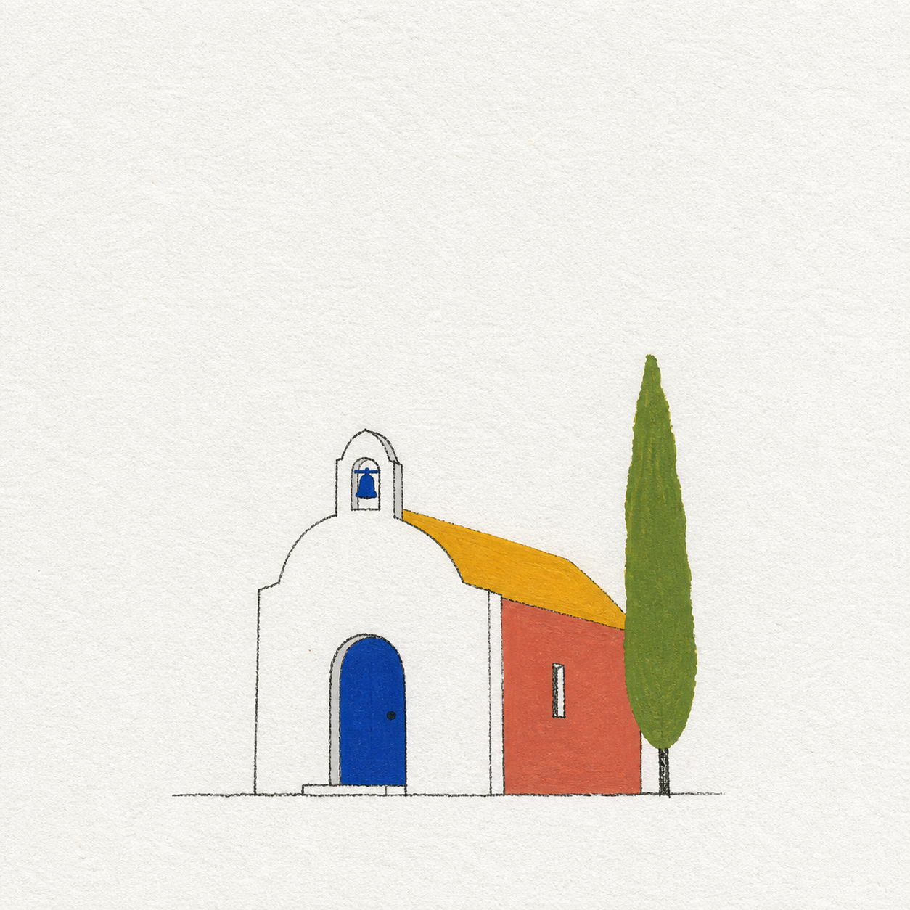

# 极简纸感丙烯建筑艺术图



## 适用

- 教堂、塔楼、现代建筑、民居、门廊、街角或旅途地标；
- 建筑外轮廓和门窗关系具有辨识度的参考图；
- 希望得到更鲜明的封面式单幅艺术图。

## 设计设定

- 风格：极简纸感丙烯 / 鲜明封面色块；
- 输出形式：单幅艺术图；
- 构图：建筑与必要前景约占画面 15%–20%，保留宽阔纸面；
- 色彩：3–4 种高区分度颜色加少量深灰线；
- 背景：不完整重建街景、天空或人流。

## 可复制提示词

```text
将参考图中的【建筑标志性外轮廓】、【主轴或高低关系】、【关键门洞/窗户】、【必要台阶/树木/人物比例锚点】和【主色】提炼为一张单幅极简纸感丙烯建筑艺术图。删除重复窗格、砖纹、招牌、远景车辆、人群与无意义装饰；不得改变建筑最具辨识度的几何关系。

使用清晰可见的粗糙白纸纹理，建筑主体约占画面 15%–20%，四周留出大面积白纸。轮廓线细、轻、略不规则，不追求工程制图精度；用 3–4 种鲜明丙烯平涂色块概括墙体、屋顶、门窗与一处环境锚点，色块有适度覆盖感和手工边缘。画面有现代封面识别度，同时保持安静、克制。

只输出完整艺术图，不出现独立相框、金属边、钥匙圈、挂孔、磁吸、底座、产品投影或商品棚拍。排除水彩、彩铅、蜡笔、纯线稿、厚重油画、3D、光滑矢量感、复杂透视背景、可读招牌、文字、Logo、签名和水印。
```

## 可调变量

- 白色现代建筑使用彩色门窗、阴影或植物色块建立层次，不把纸面全部涂白；
- 宗教或历史建筑只保留参考图中真实可见的结构，不增添未经要求的符号；
- 人物只作为比例与动作锚点时，保持小而简洁，不虚构身份细节。

## 验收重点

- 建筑主轮廓、门窗关系和高低层次仍与参考图对应；
- 画面有完整色块，不是建筑线稿或工程草图；
- 主体不超过约 20%，背景没有被街景与天空填满；
- 没有商品结构、文字、Logo、签名或水印。
