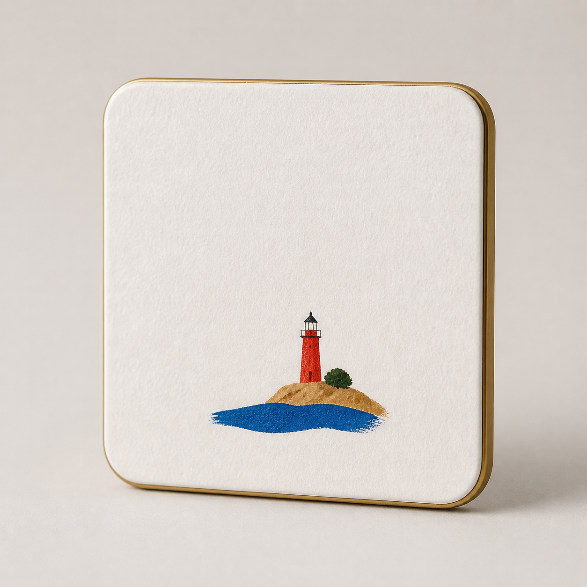

# 极简纸感丙烯风景冰箱贴



## 适用

- 海岸、灯塔、小屋、山景、建筑或其他轮廓简洁的旅行图片或文字描述；
- 希望保留极简纸感丙烯构图，同时做成一件实体纪念品；
- 横向或方形图片，或适合横向/方形组织的文字场景。

## 产品设定

- 风格：极简纸感丙烯 / 安静旅行纸页；
- 输出形式：实体纪念品；
- 载体：圆角矩形或圆形高端金属冰箱贴；
- 正面：细腻哑光艺术涂层，纸张纹理是视觉效果，不是松散纸片；
- 结构：薄而完整的金属边缘，背部磁吸不在正面出现。

## 可复制提示词

```text
依据当前输入中的【标志性风景或建筑】、【主体数量与方向】、【空间关系】和【2–4 种主色】，设计一枚真实的高端金属冰箱贴。有参考图时保留可见记忆锚点；纯文字时严格落实已描述的主体与关系。正面视觉采用极简纸感丙烯：粗糙白纸感基底，小主体、大留白，细而略不规则的深灰手绘线，以及明确、完整的丙烯平涂色块。复杂背景和重复细节应大胆归并。

冰箱贴使用圆角矩形或圆形薄金属基体，边缘细腻抛光，正面为耐久哑光艺术涂层概念；纸张颗粒只作为印制或涂层视觉，不表现为翘起、脱胶或可撕下的纸片。产品完整居中，浅暖灰摄影背景，柔和高端棚拍光与可信投影。正面不展示背部磁片。

不要：钥匙圈、挂孔、吊链、掐丝金线、玻璃珐琅釉面、松散粘贴纸、廉价塑料、树脂滴胶、水彩、彩铅、蜡笔、复杂背景、文字、品牌、签名和水印。
```

## 可调变量

- 纵向建筑可改为拱门形磁贴，但不增加吊环；
- 色块较鲜明的城市照可切换为鲜明封面色块子预设；
- 用户需要工艺沟通时，可另加背面磁吸概念视图，但不能编造实际磁力、厚度或量产材料。

## 验收重点

- 冰箱贴结构完整，没有钥匙圈、挂孔、吊链或正面磁片；
- 纸感丙烯是正面视觉语言，没有误做成掐丝珐琅或松散纸片；
- 小主体与留白关系保留，同时产品边缘、厚度与投影可信；
- 这是产品概念摄影图，不声称真实材料或工艺已确认。
