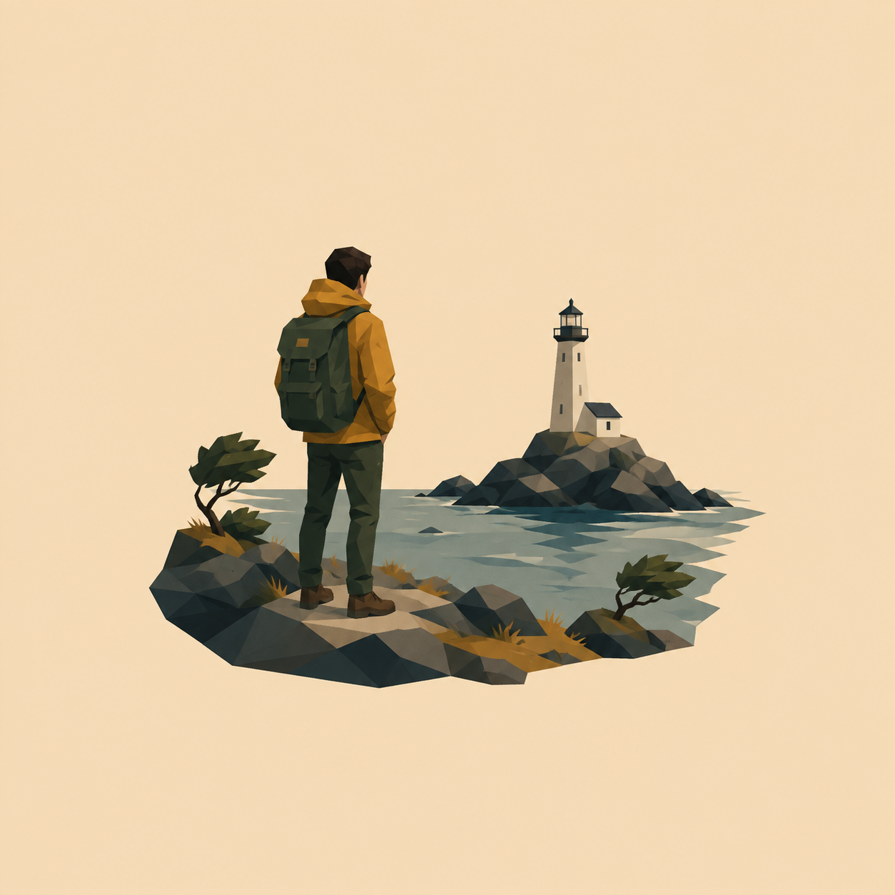

# 极简低多边形人物场景切片



## 适用

- 单人或双人旅行照、人物加宠物、人物加建筑、户外环境肖像；
- 姿态、服饰、配饰与地点关系比微小背景纹理更重要的输入；
- 希望人物仍处在原场景中，同时获得克制留白与现代编辑插画感。

## 设计设定

- 风格：极简低多边形编辑插画 / 人物场景切片；
- 展示形式：独立视觉图；
- 构图：人物与核心环境作为一个完整切片，约占画布高度 40%–52%；
- 身份保留：优先脸型、发型、姿态、服饰轮廓、配饰与人与环境的比例；
- 背景：单一纯色留白，场景沿人物、地面和地点锚点自然收边。

## 可复制提示词

```text
依据当前输入创作一张极简低多边形人物场景切片。有参考图时，严格保留【人物数量与左右顺序】、【脸型/发型等身份锚点】、【姿态与视线或行进方向】、【服饰与配饰主色】、【人与场景的比例】、【一至三个地点锚点】、【透视和原图方向】；纯文字时，严格落实已经描述的人物、动作、服饰、环境和关系，不自行指定真实身份或地点。把枝叶、岩纹、远景人群、建筑重复细节和照片噪点归并。

使用二维极简低多边形编辑插画，以中大型几何色面概括人物面部、衣褶、身体体块、地面与环境光影。切面跟随真实解剖与物体结构，面部只保留有助辨识的少量明暗面，不做密集三角马赛克。把人物与核心环境作为一个完整场景切片居中呈现，约占画布高度 40%–52%，沿人物、地形或建筑自然结束，四周保留大面积干净纯色留白。色彩自然、略降饱和，极少或不用轮廓线。

这是独立视觉图，不要商品外壳、相框、钥匙圈、挂孔、磁吸、底座或棚拍结构。排除 3D 低模人物、游戏角色、塑料模型、CGI、碎三角滤镜、渐变、纸纹、丙烯笔触、粗黑描边、卡通贴纸、文字、Logo、签名和水印。
```

## 可调变量

- 人脸相似度优先时，把人物提高到约 50%，环境只保留最关键的地点锚点；
- 背影人物优先保留发型、帽子、包、服饰色块和站姿，不臆造正脸；
- 双人画面必须保留人数、左右顺序、互动与相对身高，不把两人合并。

## 验收重点

- 人物数量、身份锚点、姿态、服饰和场景关系没有漂移；
- 地点锚点仍清楚，画面没有退化成脱离环境的头像；
- 几何切面概括清晰且数量克制，没有塑料 3D 感或密集三角脸；
- 场景自然收边、留白充分，没有产品结构、文字或水印。
