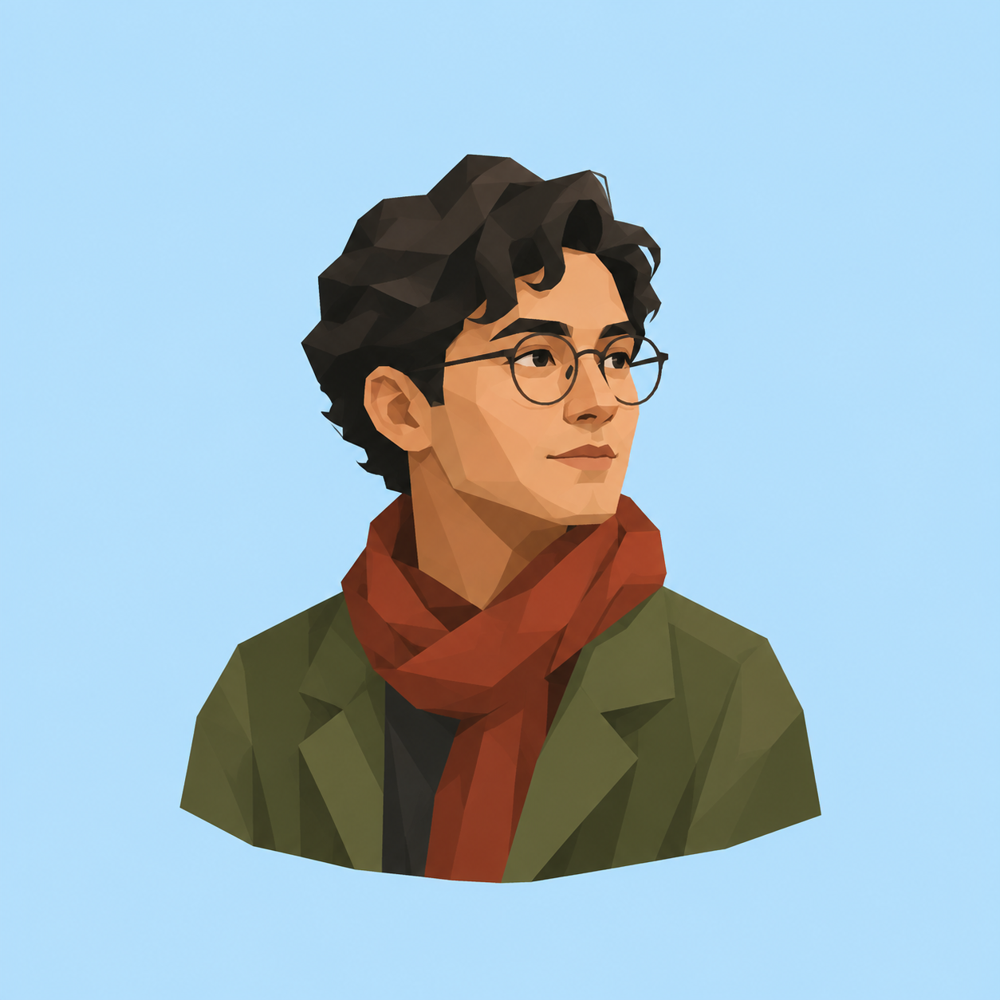

# 极简低多边形肖像海报



## 适用

- 单人、双人或宠物头像与半身像；
- 发型、脸型、眼镜、帽子、衣领、耳形或毛色分区清楚的参考图，或人物设定明确的文字描述；
- 需要独立肖像、头像、封面或预留标题区的编辑海报。

## 设计设定

- 风格：极简低多边形编辑插画 / 肖像几何海报；
- 展示形式：独立视觉图；
- 构图：头像或半身像占画布高度约 45%–65%，背景保持单一纯色；
- 结构：以少量中大型面建立面部、头发、衣领或毛色层次，身份锚点优先；
- 文案：只有用户提供准确文字时才排版，否则仅预留安全区。

## 可复制提示词

```text
依据当前输入创作一张极简低多边形肖像海报。有参考图时，严格保留【主体数量】、【脸型或头部轮廓】、【发型/耳形/毛色分区】、【眼镜/帽子/首饰等身份锚点】、【表情与视线】、【姿态】和【服饰主色】；纯文字时，落实已经描述的年龄段、外观、动作、服饰、配色与情绪，但不臆造真实人物身份。删除无意义的小皱纹、毛发丝、背景杂物和照片噪点。

使用纯二维的极简低多边形编辑插画语言，用少量中大型几何色面概括面部、头发、衣领或宠物毛色的受光面、中间面与阴影面。切面必须跟随脸部或身体结构，不使用密集碎三角、网格或机械滤镜。主体约占画布高度 45%–65%，置于干净单一纯色背景中；色彩自然、克制、略降饱和，主要靠相邻色面的明度与色相差塑形，极少或不用轮廓线。

只输出完整肖像视觉图。若用户没有提供准确文案，不生成任何文字；需要封面时按指定方向保留标题安全区。不要相框、商品外壳、挂孔、钥匙圈、磁吸、底座或棚拍结构。排除 3D 低模头像、塑料玩具、CGI、三角马赛克、渐变、纸纹、丙烯笔触、粗黑描边、卡通贴纸、Logo、签名和水印。
```

## 可调变量

- 双人肖像提高横向空间，保持左右顺序、互动和相对身高；
- 宠物肖像优先眼睛位置、耳形、口鼻轮廓与毛色分区，不添加拟人服饰；
- 封面用途可把主体移到一侧，但只能在用户指定文案方向后调整，不能随意镜像。

## 验收重点

- 主体数量与关键身份锚点清楚，没有换脸、增减人物或物种漂移；
- 面部或头部由少量结构切面塑形，不是密集三角拼图或 3D 模型；
- 单色背景和留白干净，用户要求的标题安全区可用；
- 没有未经确认的文字、商品结构、签名或水印。
