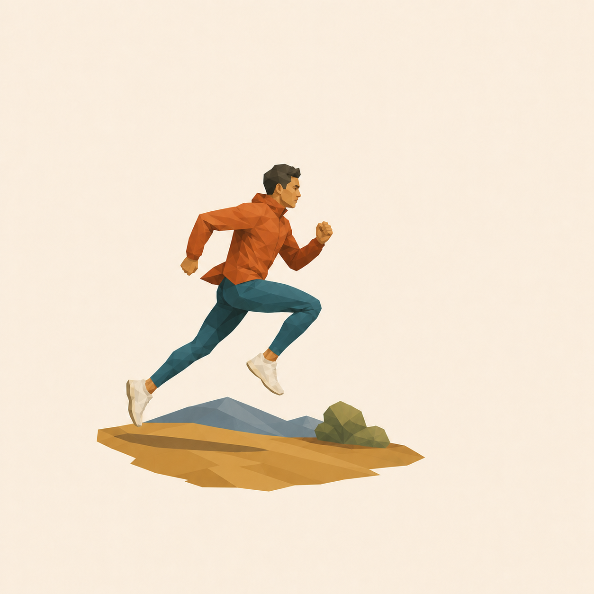

# 极简低多边形人物运动瞬间



## 适用

- 跑步、骑行、滑板、球类、舞蹈、健身或其他动作阶段明确的人物照片；
- 写明人物数量、运动类型、动作阶段、方向、服饰与环境的纯文字描述；
- 希望保留真实动作关系，同时获得现代、克制、有大面积留白的独立视觉图。

## 设计设定

- 风格：极简低多边形编辑插画 / 人物运动瞬间；
- 展示形式：独立视觉图；
- 构图：人物与必要地面或器械约占画布高度 42%–55%，运动方向一侧保留更多纯色留白；
- 动作锁定：躯干倾角、头部朝向、支撑肢、摆动肢、手脚位置、器械接触点与运动方向；
- 动势表达：依靠身体姿态、衣摆、头发和贴地几何阴影，不使用重复肢体、残影人物或液化模糊。

## 可复制提示词

```text
依据当前输入创作一张极简低多边形人物运动瞬间。有参考图时，严格保留【人物数量】、【运动项目】、【动作发生的具体阶段】、【躯干倾角与头部朝向】、【左右手臂位置】、【支撑腿与摆动腿关系】、【手脚或器械接触点】、【服饰与装备主色】、【运动方向】和【原图横竖方向】；纯文字时，逐项落实已描述动作，不自行替换成更常见的姿势。把观众、广告牌、重复场地纹理和远景杂物归并或移除。

使用纯二维极简低多边形编辑插画，以中大型几何色面概括人物解剖、衣褶、受光面和阴影面，切面必须跟随身体与器械结构。人物与必要地面或器械形成一个自然收边的完整运动切片，约占画布高度 42%–55%；在运动方向一侧保留更多干净的单一纯色留白。通过身体前倾、清晰肢体夹角、衣摆、头发和贴地几何阴影表达速度，不使用重复手脚、残影人形、液化运动模糊或装饰性速度线。

这是一张独立视觉图，不要商品外壳、相框、钥匙圈、挂孔、磁吸、底座或棚拍结构。排除 3D 低模人物、塑料模型、游戏角色、CGI、密集碎三角、渐变背景、纸纹、丙烯笔触、粗黑描边、照片矩形框、文字、号码乱码、Logo、签名与水印。
```

## 可调变量

- 跑步：保留腾空或触地阶段、摆臂方向、步幅与落脚关系，不把同侧手脚改成僵硬同步；
- 骑行或滑板：保留双手、双脚与车把、脚踏或板面的实际接触点，器械结构不能穿过身体；
- 球类：锁定球的位置、视线和控球手脚，不能凭空增加第二个球；
- 舞蹈或健身：保留重心、关节夹角和支撑点，宽松服装不能吞掉关键肢体轮廓；
- 多人运动：人数、前后关系与互动优先；画面过密时拆分为单人版本，不擅自删除人物。

## 验收重点

- 动作阶段、运动方向、四肢关系、重心与器械接触点和图片事实或文字约束一致；
- 恰好是指定人数，没有多手、多脚、融合肢体、残影人形或多余器械；
- 中大型二维切面服从人体与装备结构，动作清楚，没有 3D 塑料人物或碎三角滤镜感；
- 运动方向有呼吸空间，场景自然收边，画布没有商品结构、文字、Logo、签名或水印。
